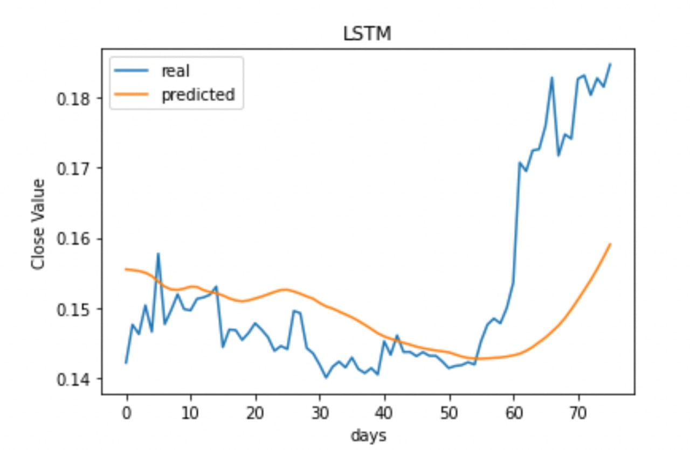
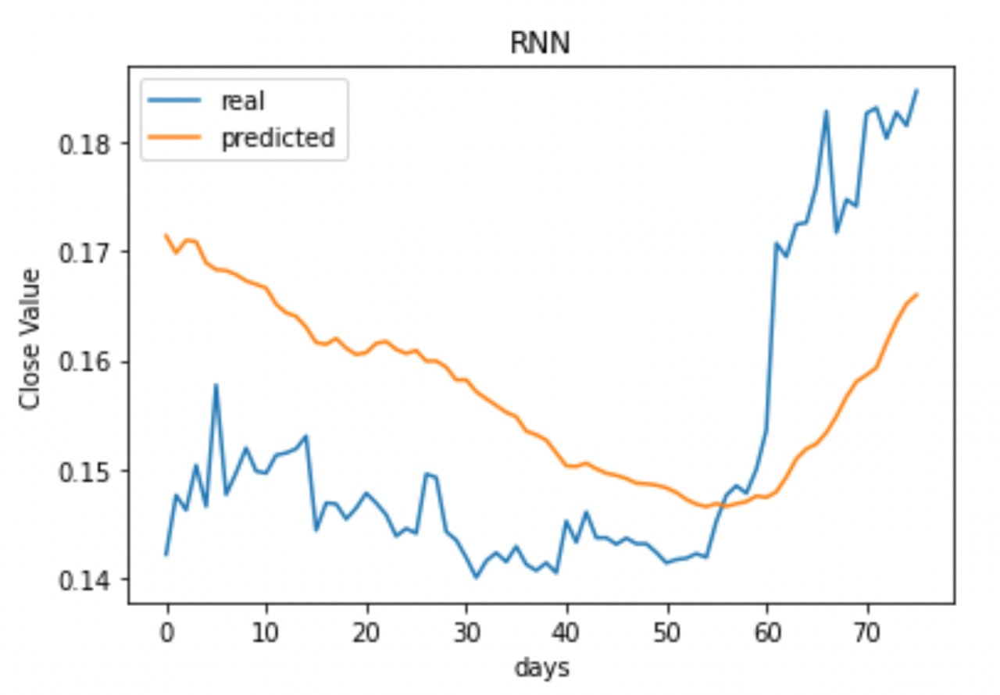
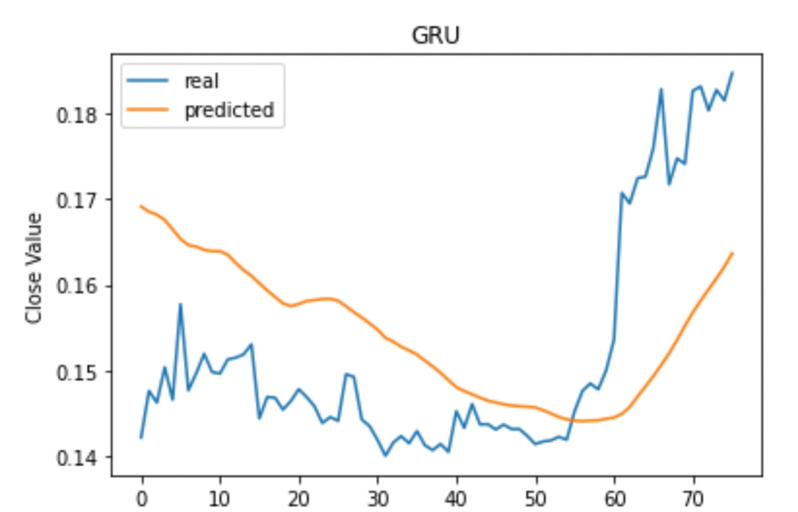

# RecurrentNeuralNetworks

## Stock Price Prediction

The first part, PricePredcition.ipynb, consist of codes that used different type of Recurrent Neural Networks such as **LSTM**, **RNN**, and **GRU** to predict the stock prices based on previous data provided.
Below is the plot of prediction accuracy using different models. 

More details about type of normalizations, dropout probability, loss functions, or optimizers are discussed in the report file.

## Sentiment Analysis

The second part however contains code in order to decode the sentiment inside a text data. we used a **BERT** layer to empower the model with the embedded data inside the **BERT** encoding vectors.
Also the data was not balanced, and we tried some ways such as replacing words with their synonyms in order to fix the unbalancy existed in data. 
More details are provided in the report.

